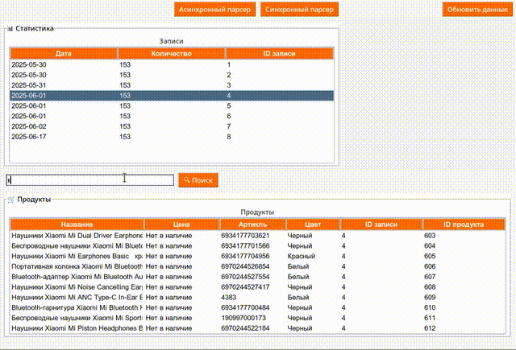

# mi-shop.com Parser — Audio Section

A desktop GUI application for parsing, displaying, and managing audio product data from [mi-shop.com](https://mi-shop.com). Built with **Python**, featuring a **Tkinter** interface, **SQLite** database, and both **asynchronous** and **synchronous** parsing options.

---

## Features

* Asynchronous and synchronous parsers
* Tkinter-based user interface
* SQLite for local data storage
* Product image display
* Search by name, article, color, price, and IDs
* Statistics panel with entry history

---

## Quick Start

### Run the App

```bash
# Clone the repository and navigate into it
git clone https://github.com/MarkOsovets/Parser__mi-shop.com
cd parser-mi-shop-audio

# Create a virtual environment (recommended)
# Linux/macOS:
python3 -m venv venv
source venv/bin/activate

# Windows (PowerShell):
# python -m venv venv
# .\venv\Scripts\Activate.ps1

# Windows (CMD):
# python -m venv venv
# .\venv\Scripts\activate.bat

# Install dependencies
pip install -r requirements.txt

# Run the application
python main.py

```
## UI Interface




---

## Application Overview

* **Parsers**: Collect audio products from mi-shop.com
* **Database**: Stores all data locally, including images (as BLOBs)
* **Interface**: User-friendly tables and buttons, Xiaomi-themed visuals
* **Search**: Fast filtering through product attributes
* **Image**: Shows preview of selected product

---

## UI Styling

* Light color palette
* Xiaomi orange (`#ff6700`) for accents
* Responsive layout using Tkinter grid
* Image support with PIL and ImageTk

